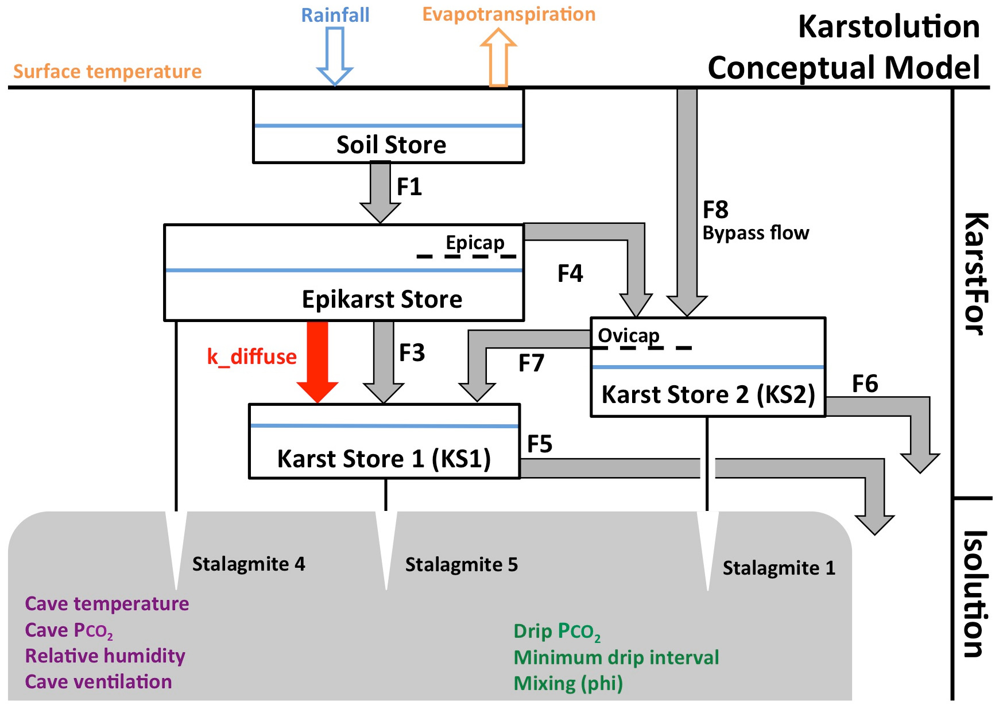

# Karstolution


[](https://mybinder.org/v2/gh/agriff86/karstolution/master?filepath=notebooks%2FKarstolution-example-2.ipynb)


Karstolution is a Speleothem δ18O Model Integrating Karst Hydrological and In-Cave Fractionation Processes.  
It couples KarstFor, a lumped parameter karst hydrology model, (Bradley et al., 2010) with ISOLTUION, a model of the in-cave calcite system (Deininger et al., 2012).

Karstolution is implemented as a python module.  Examples are provided for using it from a [python script](./example) or from [Jupyter notebooks](./notebooks).

# Conceptual Figure


# Running Karstolution online in hosted notebooks

## Binder

A demonstration run is [available via Binder](https://mybinder.org/v2/gh/agriff86/karstolution/master?filepath=notebooks%2FKarstolution-example-2.ipynb).  Binder is a free service, so this runs much slower than installing locally and may be unavailable in times of high demand, but you won't need to sign up.

## Microsoft Azure Notebooks

Karstolution has been tested with [Microsoft Azure Notebooks](https://notebooks.azure.com), a free service [currently in preview](https://notebooks.azure.com/help/preview). 

It is free to use Azure Notebooks, but you will need a Microsoft account.  To run Karstolution:

 1. Import Karstolution from github into Azure Notebooks, using this link [](https://notebooks.azure.com/import/gh/agriff86/karstolution)
 2. After import, navigate to the `notebooks` directory and run one of the examples.

The Azure environment includes the full Anaconda distribution, so all dependencies should be met.


# Local installation

## Dependancies

Python 2.7.x or Python 3.6.x
Numpy  
Scipy  
(optional) matplotlib  
(optional) pandas  
(optional) pyaml

## Installation steps

[Anaconda Python](https://www.anaconda.com) is recommended, but not essential.  The steps for installing with Anaconda are:

1. Download and install Anaconda installer from https://www.anaconda.com/download/.  The Python 3.6 version is preferred.

2. Check that dependencies are installed (these are likely to be installed already) with:
   ````sh
   conda install matplotlib numba numpy pandas pyyaml scipy
   ````

3. Download a copy of Karstolution.  With Git:
   ````sh
   git clone https://github.com/agriff86/karstolution.git
   ````
   or simply [download the zip from github](https://github.com/agriff86/karstolution/archive/master.zip) and unzip

4. Run an example script
   ````sh
   cd karstolution/example
   python example.py
   ````
   The example script writes results to `output.csv`.

5. Run the example notebooks in `karstolution/notebook`.  If you haven't run Jupyter notebooks before, [these instructions](http://jupyter-notebook-beginner-guide.readthedocs.io/en/latest/) might be a useful start.

# Configuration File

The configuration is passed to the main model routine as a `dict`, i.e. a Python dictionary.
A convenient way of soring the configuration is as a [yaml](http://yaml.org/) formatted file.
See (./example/example.py) for a working example.

```yaml
f1 : 0.2
f3 : 0.008
f5 : 0.005
f6 : 0.002
f7 : 1.0
k_diffuse : 0.008
f8 : 0.001
i : 0.5
j : 0.25
k : 0.25
m : 0.75
n : 0.25
k_eevap : 0.0
k_d18o_soil : 0.03
k_d18o_epi : 0.0
soilstore : 200.0
epicap : 400.0
ovicap : 100.0
epikarst : 400.0
ks1 : 400.0
ks2 : 200.0
lambda_weibull : 1.5
k_weibull : 1.0
mixing_parameter_phi : 1.0
# these parameters are forced by a climatological monthly mean
# (so there needs to be a list of 12 values, January-December)
monthly_forcing : 
  drip_pco2 : [4000.0,4000.0,4000.0,4000.0,4000.0,4000.0,4000.0,4000.0,4000.0,4000.0,4000.0,4000.0]
  cave_pco2 : [1000.0,1000.0,1000.0,1000.0,1000.0,1000.0,1000.0,1000.0,1000.0,1000.0,1000.0,1000.0]
  rel_humidity : [0.95,0.95,0.95,0.95,0.95,0.95,0.95,0.95,0.95,0.95,0.95,0.95]
  ventilation : [0.0,0.0,0.0,0.0,0.0,0.0,0.0,0.0,0.0,0.0,0.0,0.0]
  cave_temp : [10.0,10.0,10.0,10.0,10.0,10.0,10.0,10.0,10.0,10.0,10.0,10.0]
  drip_interval : [100.0,100.0,100.0,100.0,100.0,100.0,100.0,100.0,100.0,100.0,100.0,100.0]
initial_conditions :
  # initial level in each store
  soil : 50.0
  epikarst : 100.0
  ks1 : 230.0
  ks2 : 50.0
  diffuse : 30.0
  # initial oxygen-18 composition in each store (d18O, permille VSMOW)
  d18o_soil : -5.0
  d18o_epikarst : -4.0
  d18o_ks1 : -5.0
  d18o_ks2 : -4.0
  d18o_prevrain : -5.0
  d18o_diffuse : -4.0
```  


# Input file
The input file is a csv of climatic inputs, a similar format to that of KarstFor (example is provided).  
Note: the model steps are in months and the number of rows represents the number of model steps   
The columns are:  
tt: an id column with numbers from 1 to total number of model steps  
mm: representing the month of that model step (important for seasonality), values 1-12  
evpt: evapotranspiration (mm)  
prp: rainfall amount (mm)  
tempp: surface temperature (degree celsius)  
d18O: the δ18O of rainfall amount  

# Calculating pCO2 from Calcite

The input for Karstolution requires pCO2, the CO2-equivalent volume mixing ratio (ppm), of dripwater.  More commonly, though, Ca+ concentrations are available from field measurements.  To convert from Ca+ to pCO2, use `calc_pco2`.  For example, to calculate pCO2 for a temperature of 21 degC and Ca+ concentration of 10<sup>-3</sup> mol/l do the following:

```python
import Karstolution
pco2 = Karstolution.calc_pco2(ca=1e-3, TC=21.)
print(pco2)
```

For a more sophisticated approach to calculating pCO2, consider using [PHREEQC](https://wwwbrr.cr.usgs.gov/projects/GWC_coupled/phreeqc/).

# Reference

Bradley, Chris, et al. "Hydrological uncertainties in the modelling of cave drip-water δ18O and the implications for stalagmite palaeoclimate reconstructions." Quaternary Science Reviews 29.17-18 (2010): 2201-2214.

Deininger, Michael, et al. "Isotope disequilibrium effects: The influence of evaporation and ventilation effects on the carbon and oxygen isotope composition of speleothems–A model approach." Geochimica et Cosmochimica Acta 96 (2012): 57-79.
